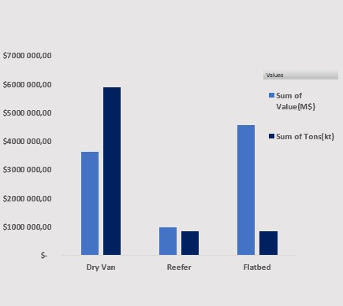

# Excel US Freight Market Dashboard


## Introduction

This US Freight Market Dashboard was designed to give analysts and logistics professionals a clear, interactive view of 2024 truck freight flows across the United States. It combines data on tonnage, ton-miles, and freight value—broken down by trailer type (Dry Van, Flatbed, Reefer), commodity group, distance band, and origin state—to reveal key patterns and opportunities in the market.

All figures are drawn from the FAF5.7 dataset and processed in Excel via Power Query and Pivot Tables measures. The dashboard’s clean layout and interactive slicers allow you to filter by trailer type, commodity, and distance to quickly uncover where freight volumes concentrate, which states lead in shipping, and which commodities drive the most revenue.

### Dashboard File
My final dashboard is in [Freight_Market_Analysis_2024.xlsx](Freight_Market_Analysis_2024.xlsx).

### Excel Skills Used

The following Excel skills were utilized for analysis:

- **📊 Pivot Charts**
- **🧮 Formulas and Functions**
- **🧹 Data Validation(Cleaning&Wrangling)**
- **🔄 Power Query**
- **🔀 Pivot Table**


### AI Skills Used

- **🚀 Promt engineering**
- **🧠 Chain-of-Thought Prompting**
- **🛠️ AI-Assisted Formula & Code Generation**
- **🔍 Context Management**
- **🐞 Debugging Guidance**
- **🎨 Visualization Design**
- **🔄 Iterative Refinement**
- **📑 Technical Documentation**


### Freight Market Dataset

The dataset used for this project contains real‐world U.S. truck freight flow data for 2024, sourced from the FHWA Freight Analysis Framework (FAF5.7).

It was ingested as CSV files and cleaned using Power Query, then analyzed with Excel Pivot Tables. The dataset includes:

- **🚚 Trailer Type: Dry Van, Flatbed, Reefer**
- **📦  Commodity Groups (SCTG2): 43 two-digit categories (e.g., Live animals, Coal, Electronics)**
- **📍  Origin State: full state names for geographic analysis**
- **🛣️ Distance Bands: predefined mileage ranges for ton-mile calculations**
- **📊  Freight Metrics: total tonnage (kt), ton-miles (M), and freight value (M USD)**
  

Source link : https://www.bts.gov/faf

## Dashboard Build

### 📉 Charts

#### 📊 Total Freight Volume & Value by Trailer Type - Clustered Column Chart





🛠️ Excel Features: Used PivotChart’s Clustered Column Chart with dual axes to display both tonnage and freight value side by side, formatted with thousands separators and custom axis titles.

🎨 Design Choice: Clustered columns highlight direct comparison across trailer types (Dry Van, Flatbed, Reefer) in one view.

📊 Data Organization: Grouped by TrailerType on the X-axis, with separate series for Sum of Tons(kt) and Sum of Value(M$); gap width reduced for tighter grouping.

💡 Insights Gained: Shows Dry Vans carry the largest volume but Flatbeds generate the highest value, while Reefers occupy a niche segment—helping focus fleet strategy and pricing models.

#### 📦 Top 5 Commodity Shares for Dry Van/Flatbed/Reefer - Doughnut Chart


🛠️ Excel Features: Used PivotChart’s Doughnut Chart with “Show Values As % of  Grand Total” and added outer data labels for clear percentage display.

🎨 Design Choice: Doughnut layout highlights part-to-whole relationships, with each slice color-coded by commodity category.

📊 Data Representation: Visualizes the top 5 SCTG commodity groups for the selected trailer type, showing their share of total value.

👁️ Visual Enhancement: Positioned labels outside slices with consistent font (Calibri 12 pt) and contrasting colors for readability.

💡 Insights Gained: Quickly identifies which commodities dominate each trailer segment (e.g., Electronics in Flatbed, Meat/Seafood in Reefer, Pharmaceuticals in Dry Van).


#### 🗺️ Top 10 Shipping States by Value and Tons - 2024 - Map Chart


🛠️ Excel Features: Used Excel’s filled Map Chart with state-level geocoding and color gradients tied to freight volume or value. Customized with tooltips and state name labels.

🎨 Design Choice: Choropleth-style color shading across U.S. states clearly communicates magnitude, with intuitive geographic context.

📊 Data Organization: Top 10 origin states selected by total tons or value. States named using a merged reference table in Power Query.

💡 Insights Gained: Highlights geographic distribution of key freight-generating states (e.g., Texas, California), helping identify logistics hubs and regional demand patterns.

### 🧮 Formulas and Functions

#### 🚚 Trailer Types 

```
= Table.AddColumn(#"Reordered Columns", "Trailer_Type", each let
    n = try Number.From([sctg2]) otherwise null
  in
    if (n >= 7 and n <= 23) or n = 4 then "Dry Van"
    else if n >= 32 and n <= 38 then "Flatbed"
    else if (n >= 1 and n <= 3) or (n >= 11 and n <= 13) or (n>=5 and n <=6) then "Reefer"
    else "Other")

```

🧠 Conditional Mapping: Uses nested if conditions to categorize freight types based on SCTG2 commodity codes.

🧮 Custom Column Logic: Leverages Power Query’s Table.AddColumn() function with a let-in expression for numeric parsing and error handling.

📦 Trailer Segmentation: Assigns each row to a trailer type — Dry Van, Flatbed, Reefer, or Other — based on commodity classification logic.

🔎 Logic-Based Grouping: Designed to align freight categories (e.g., food = Reefer, machinery = Flatbed) with their typical trailer usage in U.S. trucking.

📊 Formula Purpose: Creates a new column that enables filtered analysis by trailer type in PivotTables and charts, providing clear insight into equipment utilization.

🍽️ Background Table


📉 Dashboard Implementation


#### 🗺️ State Code to Abbreviation Mapping (Power Query Formula)

##### Step 1: Creating a reference query (mapping table)

```
let
    Source = [
        #"01" = "AL", #"02" = "AK", #"04" = "AZ", #"05" = "AR",
        #"06" = "CA", #"08" = "CO", #"09" = "CT", #"10" = "DE",
        #"11" = "DC", #"12" = "FL", #"13" = "GA", #"15" = "HI",
        #"16" = "ID", #"17" = "IL", #"18" = "IN", #"19" = "IA",
        #"20" = "KS", #"21" = "KY", #"22" = "LA", #"23" = "ME",
        #"24" = "MD", #"25" = "MA", #"26" = "MI", #"27" = "MN",
        #"28" = "MS", #"29" = "MO", #"30" = "MT", #"31" = "NE",
        #"32" = "NV", #"33" = "NH", #"34" = "NJ", #"35" = "NM",
        #"36" = "NY", #"37" = "NC", #"38" = "ND", #"39" = "OH",
        #"40" = "OK", #"41" = "OR", #"42" = "PA", #"44" = "RI",
        #"45" = "SC", #"46" = "SD", #"47" = "TN", #"48" = "TX",
        #"49" = "UT", #"50" = "VT", #"51" = "VA", #"53" = "WA",
        #"54" = "WV", #"55" = "WI", #"56" = "WY"
    ]
in
    Source
```

##### Step 2: Using the reference table in a custom column

```
Record.FieldOrDefault(
    StateMap,
    Text.PadStart(Text.From([States]), 2, "0"),
    null
)

```

- 🗺️ State Code Conversion: This Power Query (M) formula uses a reference map (a Record) to match numeric state codes with their standard two-letter abbreviations.

- 🔢 Formula Purpose: The formula converts a column with numeric identifiers (e.g., "51") into a column with human-readable text codes (e.g., "VA"), making the data more readable and ready for analysis.

#### Note: I made a new sheet with full states name and downloaded it to Power Query and made a Merge. This step was made to make the Map Chart.

🍽️ Background Table


📉 Dashboard Implementation:


### ✅ Data Validation – Clean Inputs for Freight Filters

🔍 **Filtered List:** Created controlled dropdowns using **Data Validation** for key fields:
- `Trailer Type` (Dry Van, Flatbed, Reefer)
- `Commodity Type` (based on SCTG2 mapping)
- `State Name` (mapped from numeric codes)

🔒 **Enhanced Data Entry:**  
By applying validation rules from predefined lists (cleaned via Power Query), the dashboard ensures:
- 🎯 Only valid options can be selected from dropdowns  
- 🚫 Typos and inconsistent inputs are prevented (e.g. "dryvan" or "reeferr")  
- 📊 Slicer-based visualizations remain accurate and responsive  
- 👥 Improved usability and professional workflow  

---

### 📊 Example Chart


## 📦 Conclusion

This dashboard was developed to explore and visualize key freight trends in the U.S. trucking industry using 2024 data from the FHWA Freight Analysis Framework (FAF5.7).  
By leveraging Excel tools such as **Power Query**, **PivotTables**, and **interactive charts**, the project highlights how trailer types, commodity groups, and shipping states contribute to total freight volume and value.

Through this dashboard, users can:

- Compare the performance of **Dry Van**, **Flatbed**, and **Reefer** trailers  
- Identify **top commodities** by volume and value  
- Explore **regional shipping hubs** across the United States  
- Understand the structure of U.S. freight flows in a clear, visual format

The result is a clean, professional dashboard that demonstrates real-world analytical skills for junior data analysts working with Excel.
